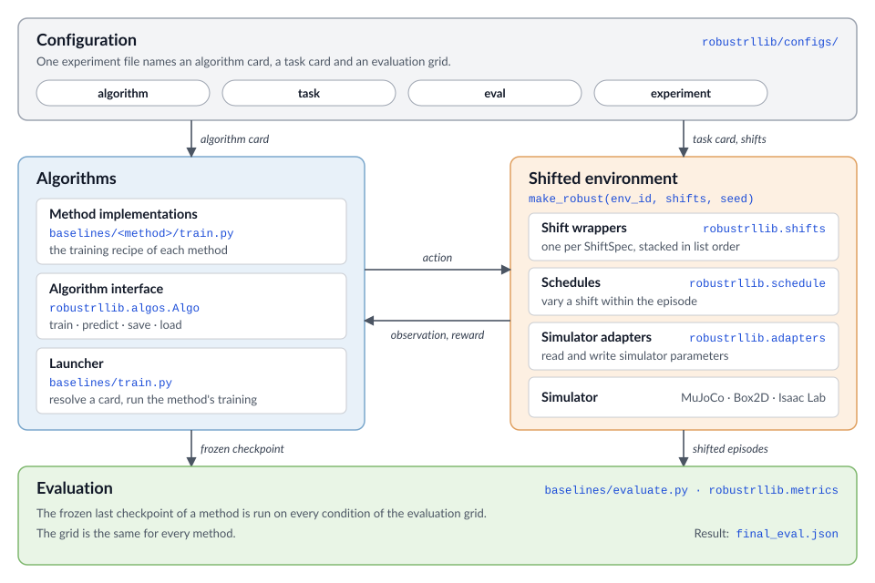

# Overview

RobustRLlib is a library and benchmark for robust reinforcement learning that takes the
**algorithm** as its unit of comparison. It holds 16 robust and robust safe methods and 6
standard algorithms behind one interface, a toolbox that declares deployment shifts, and one
evaluation protocol that is applied to all of them.

## Why an algorithm-centric library?

Robust RL has produced many mechanisms, but each is developed, trained and reported inside its
own setting. Two barriers follow.

- **Algorithms are not reusable.** Methods are spread over separate implementations and
  training pipelines. There is no single interface through which a broad collection of robust
  methods can be tried on a new problem.
- **The capability boundary is unclear.** Methods are reported under different tasks, budgets
  and shift definitions, sometimes under the very shift their mechanism targets.

## Algorithm groups

The library has four groups. Robust methods are split further by where robustness enters.

- **[Standard algorithms](../algorithms/standard/index.md).** The base learners that the
  robust methods are built on, and the reference for every comparison.
- **[Robust online algorithms](../algorithms/robust-online/index.md).** Learner-centric
  methods train against an adversary or on counterfactual replay, and environment-centric
  methods collect their rollouts in a perturbed environment.
- **[Robust offline algorithms](../algorithms/robust-offline/index.md).** Learner-centric
  methods change the backup or the regulariser, data-centric methods reshape the training
  distribution, and generative methods train on futures sampled from a learned model.
- **[Robust safe algorithms](../algorithms/robust-safe/index.md).** Methods that add a cost
  constraint and make it hold under shifted dynamics.

| Group | Methods |
|---|---|
| Standard | [IQL](../algorithms/standard/iql.md), [TD3+BC](../algorithms/standard/td3bc.md), [MOPO](../algorithms/standard/mopo.md), [SynthER](../algorithms/standard/synther.md), [PPO](../algorithms/standard/ppo.md), [SAC](../algorithms/standard/sac.md) |
| Robust online | [ATLA](../algorithms/robust-online/atla.md), [ATLA-SA](../algorithms/robust-online/atla-sa.md), [RSC](../algorithms/robust-online/rsc.md), [RARL-T](../algorithms/robust-online/rarl.md), [RARL-P](../algorithms/robust-online/rarl.md), [DR](../algorithms/robust-online/dr.md) |
| Robust offline | [RFQI](../algorithms/robust-offline/rfqi.md), [RORL](../algorithms/robust-offline/rorl.md), [ATLA-IQL](../algorithms/robust-offline/atla-iql.md), [RSC-IQL](../algorithms/robust-offline/rsc-iql.md), [RAMBO](../algorithms/robust-offline/rambo.md), [ROMB](../algorithms/robust-offline/romb.md), [FWM](../algorithms/robust-offline/fwm.md), [PLR-PVL](../algorithms/robust-offline/plr-pvl.md) |
| Robust safe | [RAMU](../algorithms/robust-safe/ramu.md), [SPiDR](../algorithms/robust-safe/spidr.md) |

## Library features

- **One interface for 22 algorithms.** Every method is launched from an experiment file and
  keeps its native training recipe and budget.
- **Attribution built in.** Every method records the mechanism it adds, the shift it claims to
  address and the base algorithm that realises it.
- **Six shift sources and five modes.** Shifts are declared as data and stacked in any order.
  See [Shift Sources and Modes](../shifts/index.md).
- **One evaluation protocol.** One frozen checkpoint of every method is evaluated on the
  same grid. See [Evaluation Protocol](../evaluation/protocol.md).
- **Extensible.** A new algorithm implements four methods, and a new simulator
  implements one adapter.

## Comparison with related benchmarks

RobustRLlib extends existing RL libraries and robustness benchmarks by combining a library of
robust algorithms with shifts on every component of the interaction loop, under one interface.

<table class="rl-compare">
<thead><tr><th>Feature</th><th>RLlib</th><th>RRLS</th><th>ODRL</th><th>Robust-Gymnasium</th><th>RWRL Suite</th><th>RoAd-RL</th><th class="rl-ours">RobustRLlib</th></tr></thead>
<tbody>
<tr><th scope="row">Robust algorithms</th><td>0</td><td>4</td><td>0</td><td>4</td><td>0</td><td>0</td><td class="rl-ours">16</td></tr>
<tr><th scope="row">MDP shifts</th><td>0/4</td><td>2/4</td><td>1/4</td><td>4/4</td><td>3/4</td><td>1/4</td><td class="rl-ours">4/4</td></tr>
<tr><th scope="row">Latency shift</th><td></td><td></td><td></td><td></td><td></td><td></td><td class="rl-ours"></td></tr>
<tr><th scope="row">Semantic shift</th><td></td><td></td><td></td><td></td><td></td><td></td><td class="rl-ours"></td></tr>
<tr><th scope="row">Compound shift</th><td></td><td></td><td></td><td></td><td></td><td></td><td class="rl-ours"></td></tr>
<tr><th scope="row">Task expansion</th><td></td><td></td><td></td><td></td><td></td><td></td><td class="rl-ours"></td></tr>
</tbody>
</table>

 supported and evaluated &nbsp;&nbsp;  partial &nbsp;&nbsp;  absent or not demonstrated

> **RobustRLlib integrates 16 robust and robust safe methods** next to 6 standard algorithms.
> It evaluates shift on **all four MDP components**: observations, actions, transitions, and
> reward or cost. It adds **Latency shift**, **Semantic shift** and **compound shift**, and
> carries the same interface to **additional simulators**.

*Robust algorithms* counts the robust or robust safe methods that a benchmark evaluates,
without standard algorithms. *MDP shifts* counts, out of four, the components on which shift
is evaluated. *Compound shift* requires several shift sources to be active at once. *Task
expansion* is an interface for carrying the benchmark to further simulators.

## Code structure

The code has four parts. **Configuration** selects what runs, **Algorithms** and the
**Shifted environment** interact during training, and **Evaluation** scores the result.

{ width="860" }

### What each part provides

| Part | Location | Interface | Meaning |
|---|---|---|---|
| Public interface | `robustrllib` | `make_robust`, `build_pipeline`, `ShiftSpec`, `make_env`, `load_config`, `bind_actor` | Everything a user script imports |
| Shift declaration | `robustrllib.spec` | `ShiftSpec(target, mode, params, schedule, seed)` | One shift, written as data |
| Pipeline | `robustrllib.pipeline` | `make_robust(env_id, shifts, seed)` | Creates the task and stacks one wrapper per shift, in list order |
| Shift wrappers | `robustrllib.shifts` | `ShiftWrapper`, one subclass per target | Applies a shift at `reset` and at `step` |
| Schedules | `robustrllib.schedule` | `make_schedule(spec)` | The Non-stationary mode: a multiplier that changes within the episode |
| Simulator adapters | `robustrllib.adapters` | `DynamicsAdapter`: `list_params`, `get_nominal`, `set_param`, `reset_all` | Reads and writes the parameters of one simulator |
| Algorithm interface | `robustrllib.algos` | `Algo`: `train`, `predict`, `save`, `load` | The contract a method implements to enter the library |
| Task environments | `robustrllib.tasks` | `make_env(task_card, shifts, seed)` | Builds the environment of a task card, for training and evaluation alike |
| Method implementations | `baselines/<method>/` | `baselines/train.py -c <experiment.yaml> --seed N` | The training recipe of each method, behind one launcher |
| Configuration | `robustrllib/configs/` | Cards: `algorithm`, `task`, `eval`, `experiment` | What to train, on which task, evaluated on which grid |
| Evaluation | `baselines/evaluate.py` | `--run <dir> [--eval <grid>]` | Runs the frozen checkpoint on every condition of a grid |
| Metrics | `robustrllib.metrics` | `normalize`, `condition_metrics`, `summary_metrics` | Turns returns into the reported scores |

Where to go next:

| To | Read |
|---|---|
| Run an existing method | [Train an algorithm](../algorithms/run-a-method.md) |
| Declare a shift | [Shift Sources and Modes](../shifts/index.md) |
| Evaluate a checkpoint | [Evaluation Protocol](../evaluation/protocol.md) |
| Add a method of your own | [Add a new algorithm](../algorithms/add-an-algorithm.md) |
| Add a simulator | [Add a physics simulation](../shifts/add-a-backend.md) |

To install the library and run a first method, continue with [Quick Start](quick-start.md).
