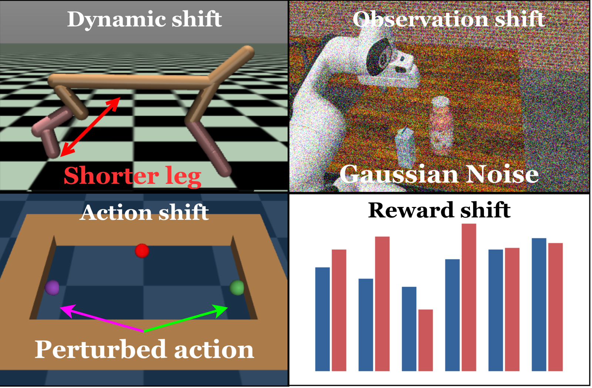

# Overview

RobustRLlib is a library and benchmark for robust reinforcement learning that takes the
**algorithm** as its unit of comparison. It holds 16 robust and robust safe methods and 6
standard algorithms behind one interface, a toolbox that declares deployment shifts, and one
evaluation protocol that is applied to all of them.

## Why an algorithm-centric library?

Robust RL has produced many mechanisms, but each is developed, trained and reported inside its
own setting. Two barriers follow.

- **Algorithms are not reusable.** Methods are spread over separate implementations and
  training pipelines. There is no single interface through which a broad collection of robust
  methods can be tried on a new problem.
- **The capability boundary is unclear.** Methods are reported under different tasks, budgets
  and shift definitions, sometimes under the very shift their mechanism targets.

## Algorithm groups

The library has four groups. Robust methods are split further by where robustness enters.

- **[Standard algorithms](../algorithms/standard/index.md).** The base learners that the
  robust methods are built on, and the reference for every comparison.
- **[Robust online algorithms](../algorithms/robust-online/index.md).** Learner-centric
  methods train against an adversary or on counterfactual replay, and environment-centric
  methods collect their rollouts in a perturbed environment.
- **[Robust offline algorithms](../algorithms/robust-offline/index.md).** Learner-centric
  methods change the backup or the regulariser, data-centric methods reshape the training
  distribution, and generative methods train on futures sampled from a learned model.
- **[Robust safe algorithms](../algorithms/robust-safe/index.md).** Methods that add a cost
  constraint and make it hold under shifted dynamics.

## Library features

- **One interface for 22 algorithms.** Every method is launched from an experiment file and
  keeps its native training recipe and budget.
- **Attribution built in.** Every method records the mechanism it adds, the shift it claims to
  address and the base algorithm that realises it.
- **Six shift sources and five modes.** Shifts are declared as data and stacked in any order.
  See [Shift Sources and Modes](../shifts/index.md).
- **One evaluation protocol.** The frozen last checkpoint of every method is evaluated on the
  same grid. See [Evaluation Protocol](../evaluation/protocol.md).
- **Extensible.** A new algorithm implements four methods, and a new simulator backend
  implements one adapter.

## Comparison with related benchmarks

| Benchmark | Robust algorithms | MDP shifts | Latency | Semantic | Compound | Task expansion |
|---|:-:|:-:|:-:|:-:|:-:|:-:|
| RLlib | 0 | 0/4 | ✗ | ✗ | ✗ | ✓ |
| RRLS | 4 | 2/4 | ✗ | ✗ | ◐ | ✓ |
| ODRL | 0 | 1/4 | ✗ | ✗ | ✗ | ✗ |
| Robust-Gymnasium | 4 | 4/4 | ✗ | ✓ | ✓ | ✓ |
| RWRL Suite | 0 | 3/4 | ✓ | ✗ | ✓ | ◐ |
| RoAd-RL | 0 | 1/4 | ✗ | ✗ | ✗ | ✓ |
| **RobustRLlib** | **16** | **4/4** | **✓** | **✓** | **✓** | **✓** |

*Robust algorithms* counts robust or robust safe methods evaluated by each benchmark, without
standard algorithms. ✓ is explicit, evaluated support; ◐ is partial support; ✗ is absent or
not demonstrated. *MDP shifts* counts, out of four, the components on which shift is
evaluated: observations, actions, transitions, and reward or cost.

### Supported algorithms

| Group | Methods |
|---|---|
| Standard | [IQL](../algorithms/standard/iql.md), [TD3+BC](../algorithms/standard/td3bc.md), [MOPO](../algorithms/standard/mopo.md), [SynthER](../algorithms/standard/synther.md), [PPO](../algorithms/standard/ppo.md), [SAC](../algorithms/standard/sac.md) |
| Robust online | [ATLA](../algorithms/robust-online/atla.md), [ATLA-SA](../algorithms/robust-online/atla-sa.md), [RSC](../algorithms/robust-online/rsc.md), [RARL](../algorithms/robust-online/rarl.md), [DR](../algorithms/robust-online/dr.md) |
| Robust offline | [RFQI](../algorithms/robust-offline/rfqi.md), [RORL](../algorithms/robust-offline/rorl.md), [ATLA-IQL](../algorithms/robust-offline/atla-iql.md), [RSC-IQL](../algorithms/robust-offline/rsc-iql.md), [RAMBO](../algorithms/robust-offline/rambo.md), [ROMB](../algorithms/robust-offline/romb.md), [FWM](../algorithms/robust-offline/fwm.md), [PLR-PVL](../algorithms/robust-offline/plr-pvl.md) |
| Robust safe | [RAMU](../algorithms/robust-safe/ramu.md), [SPiDR](../algorithms/robust-safe/spidr.md) |

## Demonstrations

### Shift sources

{ width="700" }

*A shift enters at an identifiable point of the interaction loop.*

### Robotics tasks

*Unitree G1 locomotion and Franka drawer manipulation in Isaac Lab.*

To install the library and run a first method, continue with [Quick Start](quick-start.md).
