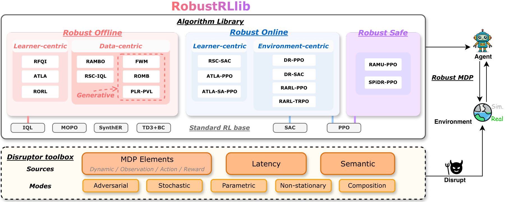

# RobustRLlib: a library for robust reinforcement learning

Robust reinforcement learning is critical for reliable real-world deployment, where policies
may fail under diverse shifts and disruptions. **RobustRLlib** is an algorithm-centric library
and benchmark. It integrates 16 representative robust online, offline and safe RL methods and
6 standard algorithms under a unified interface, together with a toolbox that declares
deployment shifts and one evaluation protocol for all methods.

{ width="820" }

*The overview of RobustRLlib.*

## First time here?

[Overview](getting-started/overview.md)
: What the library covers, how the algorithms are organised, and how it compares with
  related benchmarks.

[Quick Start](getting-started/quick-start.md)
: Install the library, build a first shifted environment, train a first method and
  evaluate it.

## Algorithms

[All Methods](algorithms/index.md)
: The 22 algorithms of the library in one table.

[Standard Algorithms](algorithms/standard/index.md)
: The base learners and references: [IQL](algorithms/standard/iql.md), [TD3+BC](algorithms/standard/td3bc.md), [MOPO](algorithms/standard/mopo.md), [SynthER](algorithms/standard/synther.md), [PPO](algorithms/standard/ppo.md), [SAC](algorithms/standard/sac.md).

[Robust Online Algorithms](algorithms/robust-online/index.md)
: [ATLA](algorithms/robust-online/atla.md), [ATLA-SA](algorithms/robust-online/atla-sa.md), [RSC](algorithms/robust-online/rsc.md), [RARL](algorithms/robust-online/rarl.md), [DR](algorithms/robust-online/dr.md).

[Robust Offline Algorithms](algorithms/robust-offline/index.md)
: [RFQI](algorithms/robust-offline/rfqi.md), [RORL](algorithms/robust-offline/rorl.md), [ATLA-IQL](algorithms/robust-offline/atla-iql.md), [RSC-IQL](algorithms/robust-offline/rsc-iql.md), [RAMBO](algorithms/robust-offline/rambo.md), [ROMB](algorithms/robust-offline/romb.md), [FWM](algorithms/robust-offline/fwm.md), [PLR-PVL](algorithms/robust-offline/plr-pvl.md).

[Robust Safe Algorithms](algorithms/robust-safe/index.md)
: [RAMU](algorithms/robust-safe/ramu.md), [SPiDR](algorithms/robust-safe/spidr.md).

[Run a Method](algorithms/run-a-method.md)
: The configuration files, the launch commands and the run directory.

[Add an Algorithm](algorithms/add-an-algorithm.md)
: Implement the algorithm interface and register a method of your own.

## Shift sources and modes

[Overview](shifts/index.md)
: How a shift is declared, and which shift sources accept which modes.

Shift sources
: [Dynamic shift](shifts/sources/dynamic.md), [Observation shift](shifts/sources/observation.md),
  [Action shift](shifts/sources/action.md), [Reward/cost shift](shifts/sources/reward-cost.md),
  [Latency shift](shifts/sources/latency.md), [Semantic shift](shifts/sources/semantic.md).

Shift modes
: [Stochastic](shifts/modes/stochastic.md), [Adversarial](shifts/modes/adversarial.md),
  [Parametric](shifts/modes/parametric.md), [Non-stationary](shifts/modes/non-stationary.md),
  [Composition](shifts/modes/composition.md).

[Add a Backend](shifts/add-a-backend.md)
: Carry the shifts to a simulator of your own.

## Evaluation

[Evaluation Protocol](evaluation/protocol.md)
: Evaluate a frozen checkpoint on a perturbation grid and report the result.
