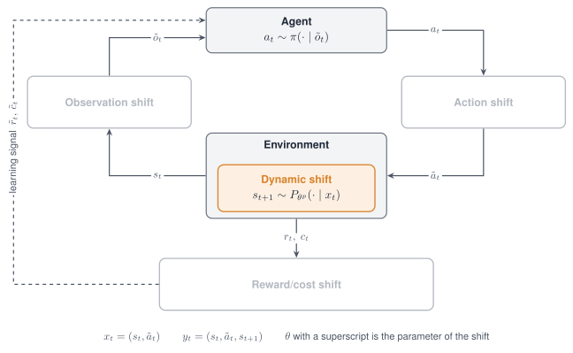

# Dynamic shift

A Dynamic shift changes how the world moves. It edits a physical parameter of the simulator,
applies an external force to a body, or perturbs the simulator state between steps.

{ width="760" }

*The Dynamic shift acts inside the environment: the next state is drawn from a shifted transition.*

<figure class="rl-shift-comparison">
  <div class="rl-shift-clips">
    <div><span>Nominal</span><video src="../../../../assets/shifts/dynamic-carrace_nominal_web.mp4" poster="../../../../assets/shifts/dynamic-carrace_nominal_web.jpg" autoplay muted loop playsinline controls preload="metadata" aria-label="CarRacing with nominal dynamics"></video></div>
    <div><span>Shifted</span><video src="../../../../assets/shifts/dynamic-carrace_shift_web.mp4" poster="../../../../assets/shifts/dynamic-carrace_shift_web.jpg" autoplay muted loop playsinline controls preload="metadata" aria-label="CarRacing with shifted dynamics"></video></div>
  </div>
  <figcaption>CarRacing under nominal and shifted dynamics.</figcaption>
</figure>

## Properties

| Aspect | Dynamic shift |
|---|---|
| Perturbs | Physical parameters, external forces, the simulator state |
| Targets in code | `dynamics` and `transition` |
| Modes | Stochastic, Parametric, Non-stationary, Composition |
| Applied | Parameter edits at every `reset`; forces during a push; state noise after every step |
| Acts on a frozen policy | Yes |
| Backends | MuJoCo for every mode name; Box2D for parameter edits |

## Supported modes

| Mode | Mode name in code | What it does |
|---|---|---|
| [Stochastic](../modes/stochastic.md) | `gauss`, `uniform`, `loguniform` | Draws a factor once per episode and multiplies the nominal value by it |
| [Stochastic](../modes/stochastic.md) | `push` | Applies a force to one body for a few steps, at regular intervals, with a drawn direction and phase |
| [Stochastic](../modes/stochastic.md) | `gauss` on the target `transition` | Adds Gaussian noise to positions and velocities after every step |
| [Parametric](../modes/parametric.md) | `scale` | Sets the parameter to its nominal value times a factor |
| [Parametric](../modes/parametric.md) | `set` | Sets the parameter to an absolute value |
| [Parametric](../modes/parametric.md) | `translate` | Adds an offset in metres to a position |
| [Non-stationary](../modes/non-stationary.md) | `schedule` on `scale`, `translate`, `push` and `transition` | Varies the factor, offset, force or noise within the episode |
| [Composition](../modes/composition.md) | Several shifts in one list | Edits several parameters at once |

**The target `transition` accepts only the mode name `gauss`**; any other mode name raises
`ValueError` when the environment is built. The Adversarial mode is not defined for this shift.

## Parameters

Parameter edits on the target `dynamics`:

| Mode name | Parameter | Type | Default | Meaning |
|---|---|---|---|---|
| all but `push` | `param` | str | required | Name of the physical parameter |
| | `index` | int, str or `"all"` | `None` | Entity by position or by name, or every entity |
| `scale` | `factor` | float | `1.0` | Factor on the nominal value |
| `set` | `value` | float or list | required | Absolute value |
| `gauss` | `mu`, `sigma` | float | `1.0`, `0.1` | Mean and standard deviation of the factor |
| `uniform` | `low`, `high` | float | `0.8`, `1.2` | Bounds of the factor |
| `loguniform` | `low`, `high` | float | `0.8`, `1.2` | Bounds of a factor drawn uniformly in log space; both positive |
| `gauss`, `uniform`, `loguniform` | `operation` | str | `"scale"` | With `"set"` the drawn number is the value itself |
| | `nominal` | float | required with `"set"` | The value a schedule multiplier of 0 maps to |
| `translate` | `offset` | list of float | required | Offset in metres |

External force and state noise:

| Mode name | Parameter | Type | Default | Meaning |
|---|---|---|---|---|
| `push` | `body` | str | `"torso"` | Body that receives the force |
| | `interval` | int | `200` | Control steps between the onsets of two pushes |
| | `duration` | int | `10` | Control steps a push lasts |
| | `force` | float | `50.0` | Magnitude in newtons |
| | `direction` | str or list | `"random_xy"` | `"random_xy"`, `"random_x"`, or a fixed vector of three numbers |
| `gauss` on `transition` | `q_sigma` | float | `sigma`, else `0.0` | Standard deviation of the noise on positions |
| | `v_sigma` | float | `sigma`, else `0.0` | Standard deviation of the noise on velocities |

Names of physical parameters on MuJoCo tasks:

| `param` | Edits |
|---|---|
| `gravity`, `wind` | One component of the gravity or wind vector; by default the vertical component of gravity |
| `body_mass`, `body_inertia` | Mass of a body; first component of its inertia |
| `body_pos`, `body_pos_xyz` | Vertical component, or the full vector, of the offset of a body from its parent; the full vector scales limb length |
| `dof_damping`, `dof_frictionloss` | Damping and dry friction of a joint |
| `geom_friction` | Sliding friction of a geom |
| `geom_size`, `geom_size_xyz` | First size component, or the full size vector, of a geom |
| `actuator_gear` | Gear of an actuator, its control authority |
| `freejoint_pos` | Position of a free-floating body |

Box2D tasks use the names `gravity`, `enable_wind`, `wind_power`, `turbulence_power`,
`main_engine_power`, `side_engine_power`, `engine_power` and `friction`.

## Declare the shift

Every example on this page passes the check below.

```python
from robustrllib import make_robust, ShiftSpec


def check(spec, env_id="Hopper-v5"):
    env = make_robust(env_id, shifts=[spec], seed=0)
    env.reset(seed=0)
    env.step(env.action_space.sample())
    env.close()
```

Parametric:

```python
PARAMETRIC = {
    "scale":     ShiftSpec("dynamics", "scale", {"param": "body_mass", "index": "torso", "factor": 1.5}),
    "set":       ShiftSpec("dynamics", "set", {"param": "dof_frictionloss", "index": "all", "value": 0.5}),
    "translate": ShiftSpec("dynamics", "translate", {"param": "body_pos_xyz", "index": "foot",
                                                     "offset": [0.06, 0.0, 0.0]}),
}
```

Stochastic:

```python
STOCHASTIC = {
    "gauss":      ShiftSpec("dynamics", "gauss", {"param": "gravity", "mu": 1.0, "sigma": 0.05}),
    "uniform":    ShiftSpec("dynamics", "uniform", {"param": "actuator_gear", "index": "all",
                                                    "low": 0.8, "high": 1.2}),
    "loguniform": ShiftSpec("dynamics", "loguniform", {"param": "dof_damping", "index": "all",
                                                       "low": 0.5, "high": 2.0}),
    "absolute":   ShiftSpec("dynamics", "uniform", {"param": "dof_frictionloss", "index": "all",
                                                    "operation": "set", "nominal": 0.0,
                                                    "low": 0.0, "high": 1.0}),
    "push":       ShiftSpec("dynamics", "push", {"body": "torso", "interval": 250, "duration": 12,
                                                 "force": 60.0, "direction": "random_x"}),
    "transition": ShiftSpec("transition", "gauss", {"q_sigma": 0.001, "v_sigma": 0.01}),
}
```

Non-stationary, with the factor range written into the schedule:

```python
NON_STATIONARY = ShiftSpec(
    "dynamics", "scale", {"param": "actuator_gear", "index": "all", "factor": 1.0},
    schedule={"type": "sine", "start": 0.8, "end": 1.2, "period": 200},
)
```

Composition, and the values it writes into the model:

```python
env = make_robust("Hopper-v5", shifts=[
    ShiftSpec("dynamics", "scale", {"param": "gravity", "factor": 1.2}),
    ShiftSpec("dynamics", "scale", {"param": "actuator_gear", "index": "all", "factor": 0.8}),
], seed=0)
env.reset(seed=0)
model = env.unwrapped.model
print(round(model.opt.gravity[2], 3), model.actuator_gear[:, 0])
```

```text
-11.772 [160. 160. 160.]
```

The names a task accepts are listed by its adapter.

```python
from robustrllib.adapters import get_adapter

names = get_adapter(make_robust("Hopper-v5")).list_params()
```

## Rules

- A parameter of one entity is always written with `index`; **without `index` the shift
  addresses entity 0**, which for MuJoCo bodies is the world body.
- A factor is relative to the nominal value, so repeated resets do not compound it.
- One parameter and index is addressed by one shift only; of two shifts on the same parameter
  the later one wins.
- A parameter whose nominal value is zero is randomized with `operation: set` and a `nominal`.
- `translate` is written for position vectors: `body_pos_xyz`, `freejoint_pos`, `cam_pos` and
  `light_pos`.
- The drawn mode names are not combined with a schedule, because they would then draw at every
  step.
- `push`, `transition` and `translate` need a MuJoCo task.
