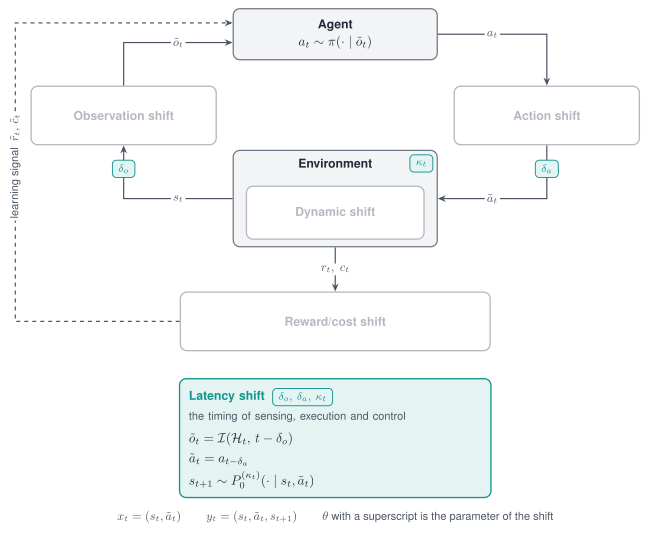

# Latency shift

A Latency shift changes timing: when an action takes effect, when an observation arrives, how
long a control period lasts, and when a reward is paid. A delay changes the loop that the policy
closes around the plant, which noise on an observation or an action cannot imitate.

{ width="760" }

*The Latency shift acts on timing: the delay of the observation, the delay of the action and the control period.*

<figure class="rl-shift-comparison rl-shift-comparison-tall">
  <div class="rl-shift-clips">
    <div><span>Nominal</span><video src="../../../../assets/shifts/halfcheetah_sac_nominal_8s.mp4" poster="../../../../assets/shifts/halfcheetah_sac_nominal_8s.jpg" autoplay muted loop playsinline controls preload="metadata" aria-label="HalfCheetah with nominal control timing"></video></div>
    <div><span>Shifted</span><video src="../../../../assets/shifts/halfcheetah_sac_latency_8s.mp4" poster="../../../../assets/shifts/halfcheetah_sac_latency_8s.jpg" autoplay muted loop playsinline controls preload="metadata" aria-label="HalfCheetah with action latency"></video></div>
  </div>
  <figcaption>HalfCheetah under nominal control and action latency.</figcaption>
</figure>

## Properties

| Aspect | Latency shift |
|---|---|
| Perturbs | The timing of actions, observations, the control period and the reward |
| Target in code | `latency` |
| Modes | Stochastic, Parametric, Non-stationary, Composition |
| Units | Control steps for `fixed`, `buffer` and `delay`; seconds for `substep` and `interp` |
| Acts on a frozen policy | `fixed`, `buffer`, `substep` and `interp`; `delay` is applied during training |
| Simulators | Any; `substep` needs a MuJoCo task that exposes `frame_skip` or `n_substeps` |

## Supported modes

| Mode | Mode name in code | What it does |
|---|---|---|
| [Parametric](../modes/parametric.md) | `fixed` | Applies every action a constant number of control steps late |
| [Parametric](../modes/parametric.md) | `delay` | Pays the reward late; observation and action stay on time |
| [Stochastic](../modes/stochastic.md) | `buffer` | Applies every action late by a number of steps drawn per episode or per step |
| [Stochastic](../modes/stochastic.md) | `substep` | Holds every action for a control period of random length |
| [Stochastic](../modes/stochastic.md) | `interp` | Returns the observation as it was some seconds ago, by interpolation of the observation history |
| [Non-stationary](../modes/non-stationary.md) | `schedule` on `substep` and `interp` | Varies the excess of the period, or the delay, within the episode |
| [Composition](../modes/composition.md) | Several shifts in one list | Combines action delay, observation delay and a variable period |

The models behind `substep` and `interp` come from two sim-to-real studies: the randomized
control period of Peng et al. (*Sim-to-Real Transfer of Robotic Control with Dynamics
Randomization*, 2018) and the interpolated observation history of Tan et al. (*Sim-to-Real:
Learning Agile Locomotion For Quadruped Robots*, 2018). The Adversarial mode is not defined for
this shift.

## Parameters

| Mode name | Parameter | Type | Default | Meaning |
|---|---|---|---|---|
| `fixed` | `steps` | int | required | Delay of the action in control steps; 0 is the identity |
| `buffer` | `low` | int | `0` | Smallest action delay |
| | `high` | int | `1` | Largest action delay, inclusive |
| | `resample` | str | unset | `"step"` draws a new delay at every step instead of once per episode |
| `substep` | `lambda_low` | float | `125.0` | Lower bound of the rate of the random excess, per second |
| | `lambda_high` | float | `1000.0` | Upper bound of that rate, per second |
| | `dt0` | float | The nominal control period | Base period in seconds |
| `interp` | `low` | float | `0.0` | Smallest observation delay in seconds |
| | `high` | float | `0.0` | Largest observation delay in seconds |
| | `resample` | str | unset | `"step"` draws a new delay at every step instead of once per episode |
| | `control_dt` | float | `1.0` | Control period in seconds, used only if the task has no `dt` attribute |
| `delay` | `steps` | int | `1` | Reward delay in control steps; at least 1 |
| | `release` | str | `"interval"` | `"interval"` pays the accumulated reward every `steps` steps; `"shift"` pays each reward `steps` steps late |

With `substep`, the control period is the base period plus a random excess. The excess is drawn
at every step from an exponential distribution whose rate is drawn once per episode between
`lambda_low` and `lambda_high`; the mean excess is one over the rate, so the default bounds add
between 1 ms and 8 ms on average.

## Declare the shift

```python
import numpy as np
import robustrllib.gym as gym
from robustrllib import ShiftSpec, build_pipeline, make_robust

PARAMETRIC = {
    "fixed": ShiftSpec("latency", "fixed", {"steps": 2}),
    "delay": ShiftSpec("latency", "delay", {"steps": 16, "release": "interval"}),
}
STOCHASTIC = {
    "buffer":  ShiftSpec("latency", "buffer", {"low": 0, "high": 2}),
    "substep": ShiftSpec("latency", "substep", {"lambda_low": 125.0, "lambda_high": 1000.0}),
    "interp":  ShiftSpec("latency", "interp", {"low": 0.004, "high": 0.008}),
}
```

Non-stationary, with an observation delay that grows within the episode:

```python
NON_STATIONARY = ShiftSpec(
    "latency", "interp", {"low": 0.008, "high": 0.008, "resample": "step"},
    schedule={"type": "linear", "start": 0.0, "end": 1.0, "t0": 0, "t1": 500},
)
```

Composition of the three execution delays:

```python
COMPOSITION = [
    STOCHASTIC["substep"],
    ShiftSpec("latency", "fixed", {"steps": 1}),
    ShiftSpec("latency", "interp", {"low": 0.002, "high": 0.004}),
]
env = make_robust("Hopper-v5", shifts=COMPOSITION, seed=0)
```

### Delayed actions

A recording wrapper between the task and the shift shows the action that reaches the simulator.

```python
class Recorder(gym.Wrapper):
    def __init__(self, env):
        super().__init__(env)
        self.applied = []

    def step(self, action):
        self.applied.append(float(np.asarray(action)[0]))
        return self.env.step(action)


def applied_actions(spec, steps=6, seed=0):
    recorder = Recorder(make_robust("Hopper-v5"))
    env = build_pipeline(recorder, [spec], seed=seed)
    env.reset(seed=seed)
    for t in range(steps):
        env.step(np.full(3, 0.1 * (t + 1)))      # issue 0.1, 0.2, 0.3, ...
    env.close()
    return np.round(recorder.applied, 1).tolist()


print(applied_actions(ShiftSpec("latency", "fixed", {"steps": 0})))
print(applied_actions(ShiftSpec("latency", "fixed", {"steps": 2})))
```

```text
[0.1, 0.2, 0.3, 0.4, 0.5, 0.6]
[0.1, 0.1, 0.1, 0.2, 0.3, 0.4]
```

During the first steps the wrapper applies the first action of the episode and not a zero
action, because a zero command is a real torque.

### Variable control period

```python
def simulated_time(shifts, steps=100):
    env = make_robust("Hopper-v5", shifts=shifts, seed=0, terminate_when_unhealthy=False)
    env.reset(seed=0)
    for _ in range(steps):
        env.step(np.zeros(3))
    elapsed, frame_skip = env.unwrapped.data.time, env.unwrapped.frame_skip
    env.close()
    return round(float(elapsed), 3), frame_skip


print(simulated_time([]))
print(simulated_time([STOCHASTIC["substep"]]))
```

```text
(0.8, 4)
(1.414, 4)
```

One hundred nominal steps cover 0.8 s of simulated time; under the shift the same actions cover
more. The `frame_skip` of the task is back at its nominal value after every step.

### Delayed reward

```python
def rewards(shifts, steps=12):
    env = make_robust("Hopper-v5", shifts=shifts, seed=0, terminate_when_unhealthy=False)
    env.reset(seed=0)
    out = [float(env.step(np.zeros(3))[1]) for _ in range(steps)]
    env.close()
    return np.round(out, 2).tolist()


print(rewards([]))
print(rewards([ShiftSpec("latency", "delay", {"steps": 4, "release": "interval"})]))
print(rewards([ShiftSpec("latency", "delay", {"steps": 4, "release": "shift"})]))
```

```text
[1.0, 1.0, 1.0, 1.0, 1.0, 1.0, 1.0, 1.0, 1.0, 1.0, 1.0, 1.01]
[0.0, 0.0, 0.0, 3.99, 0.0, 0.0, 0.0, 3.98, 0.0, 0.0, 0.0, 4.0]
[0.0, 0.0, 0.0, 0.0, 1.0, 1.0, 1.0, 1.0, 1.0, 1.0, 1.0, 1.0]
```

Both release rules pay out everything that is still withheld when the episode terminates or is
truncated, so **the undiscounted return of a complete episode is preserved**. The delay acts
while a method trains: `robustrllib/configs/train_shifts.yaml` defines the arms the benchmark
uses, and `baselines/train.py --train-shift reward_delay_16` selects one. An online method trains
on its environment with the shift stacked on it; an offline method receives it on the rewards of
its dataset, along each recorded episode.

```yaml title="robustrllib/configs/train_shifts.yaml (excerpt)"
reward_delay_16:
- target: latency
  mode: delay
  params: {steps: 16, release: interval}
```

!!! note
    `ShiftSpec("reward", "delay", ...)` builds the same wrapper as the target `latency`.

## Rules

- All five timing mode names are written on the target `latency`.
- `fixed` is the mode name for a shift factor of an evaluation grid, because it adds no
  variance of its own.
- `buffer` needs nothing from the simulator and runs on any simulator.
- **`substep` is written only for MuJoCo tasks**; on other tasks it raises
  `NotImplementedError` when the environment is built.
- `interp` delays are given in seconds, which grades the delay below one control step.
- `delay` is applied during training, and the policy is evaluated on the nominal task.
- A `fixed` shift always carries `steps`; a missing one raises `KeyError` at the first `reset`.
