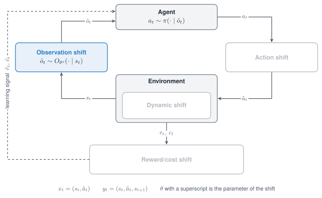

# Observation shift

An Observation shift changes what the policy is shown. It perturbs the observation on its way
from the task to the policy and leaves the state of the simulator untouched.

{ width="760" }

*The Observation shift acts between the environment and the agent: the policy is shown a perturbed observation.*

<figure class="rl-shift-comparison">
  <div class="rl-shift-clips">
    <div><span>Nominal</span><video src="../../../../assets/shifts/observation-hopper_nominal_web.mp4" poster="../../../../assets/shifts/observation-hopper_nominal_web.jpg" autoplay muted loop playsinline controls preload="metadata" aria-label="Hopper with nominal observations"></video></div>
    <div><span>Shifted</span><video src="../../../../assets/shifts/observation-hopper_shift_web.mp4" poster="../../../../assets/shifts/observation-hopper_shift_web.jpg" autoplay muted loop playsinline controls preload="metadata" aria-label="Hopper with Gaussian observation noise"></video></div>
  </div>
  <figcaption>The same SAC policy on Hopper, with nominal observations and with Gaussian noise (sigma 0.10) on every observation.</figcaption>
</figure>

## Properties

| Aspect | Observation shift |
|---|---|
| Perturbs | The observation returned by `reset` and by `step` |
| Target in code | `observation` |
| Modes | Stochastic, Adversarial, Parametric, Non-stationary, Composition |
| Observations | Arrays and dictionaries; the Adversarial mode needs an array |
| Acts on a frozen policy | Yes |
| Simulators | Any; the shift needs nothing from the simulator |

## Supported modes

| Mode | Mode name in code | What it does |
|---|---|---|
| [Stochastic](../modes/stochastic.md) | `gauss` | Adds Gaussian noise with one standard deviation for all features |
| [Stochastic](../modes/stochastic.md) | `uniform` | Adds uniform noise from one interval for all features |
| [Stochastic](../modes/stochastic.md) | `relative` | Adds Gaussian noise whose standard deviation is a fraction of the scale of each feature |
| [Stochastic](../modes/stochastic.md) | `bias` | Adds an offset that is drawn once per episode, a sensor zero-offset |
| [Adversarial](../modes/adversarial.md) | `adversarial` | Searches a ball around the true observation for the point that changes the action of the policy the most |
| [Parametric](../modes/parametric.md) | `shift` | Adds the same constant offset to every feature |
| [Non-stationary](../modes/non-stationary.md) | `schedule` on any of the six mode names | Varies the noise level, the offset or the radius within the episode |
| [Composition](../modes/composition.md) | Several shifts in one list | Stacks noise sources; a later shift sees the output of the earlier ones |

## Parameters

| Mode name | Parameter | Type | Default | Meaning |
|---|---|---|---|---|
| all but `adversarial` | `keys` | list of str | `["observation"]`, else all keys | Entries of a dictionary observation to perturb |
| `gauss` | `mu` | float | `0.0` | Mean of the noise |
| | `sigma` | float | `0.05` | Standard deviation, in raw observation units |
| `uniform` | `low`, `high` | float | minus `range`, `range` | Bounds of the noise |
| | `range` | float | `0.1` | Shorthand for a symmetric interval |
| `relative` | `frac` | float | `0.05` | Standard deviation as a fraction of the scale of each feature |
| | `ref_std` | list of float | `None` | Scale per feature; without it, a running estimate |
| `bias` | `low`, `high` | float | `-0.05`, `0.05` | Bounds of the offset |
| | `sigma` | float | `0.0` | If positive, the offset is drawn from a Gaussian instead |
| `shift` | `shift` | float | `value`, else `0.0` | The offset |
| `adversarial` | `eps` | float | `0.05` | Radius of the ball, in the maximum norm and in raw units |
| | `steps` | int | `10` | Iterations of the gradient search; at least 1 |
| | `actor` | callable | `None` | The policy, from a float32 tensor of shape `[1, obs_dim]` to the action tensor |

By default a goal-conditioned task keeps its goal entries intact: only the entry `observation`
of a dictionary observation is perturbed.

## Declare the shift

```python
from robustrllib import make_robust, ShiftSpec

HOPPER_STD = [0.16224, 0.06263, 0.20793, 0.28864, 0.61124, 0.81605,
              1.43574, 1.15449, 2.2949, 3.3575, 6.1127]

STOCHASTIC = {
    "gauss":    ShiftSpec("observation", "gauss", {"sigma": 0.05}),
    "uniform":  ShiftSpec("observation", "uniform", {"low": -0.10, "high": 0.10}),
    "relative": ShiftSpec("observation", "relative", {"frac": 0.05, "ref_std": HOPPER_STD}),
    "bias":     ShiftSpec("observation", "bias", {"low": -0.05, "high": 0.05}),
}
PARAMETRIC = ShiftSpec("observation", "shift", {"shift": 0.01})
```

The values of `HOPPER_STD` are those of the grid
`robustrllib/configs/eval/part2_hopper.yaml`.

Adversarial, with a small hand-made actor:

```python
import torch

torch.manual_seed(0)
weights = torch.randn(3, 11)


def actor(obs):
    return torch.tanh(obs @ weights.T)


ADVERSARIAL = ShiftSpec("observation", "adversarial", {"eps": 0.05, "steps": 10, "actor": actor})
```

Non-stationary, with noise that grows over the first 500 steps of the episode:

```python
NON_STATIONARY = ShiftSpec(
    "observation", "gauss", {"sigma": 0.1},
    schedule={"type": "linear", "start": 0.0, "end": 1.0, "t0": 0, "t1": 500},
)
```

Composition of a sensor offset and sensor noise:

```python
COMPOSITION = [
    ShiftSpec("observation", "bias", {"low": -0.02, "high": 0.02}),
    ShiftSpec("observation", "relative", {"frac": 0.05, "ref_std": HOPPER_STD}),
]
```

The shift changes the observation and nothing else. The state of the simulator is read from
the task for comparison.

```python
import numpy as np

env = make_robust("Hopper-v5", shifts=[STOCHASTIC["bias"]], seed=0)
obs, _ = env.reset(seed=0)
offset = obs - env.unwrapped._get_obs()
obs, *_ = env.step(np.zeros(3))
print(np.allclose(obs - env.unwrapped._get_obs(), offset))
```

```text
True
```

The offset of `bias` is the same at `reset` and after the step, and it is drawn again at the
next `reset`.

On a dictionary observation, `keys` selects the entries.

```python
GOAL_TASK = ShiftSpec("observation", "gauss", {"sigma": 0.05, "keys": ["observation"]})
env = make_robust("PointMaze_UMaze-v3", shifts=[GOAL_TASK], seed=0)
obs, _ = env.reset(seed=0)
print(sorted(obs))
```

```text
['achieved_goal', 'desired_goal', 'observation']
```

## Rules

- `sigma`, the bounds and `eps` are given in raw observation units.
- An evaluation grid gives `relative` a `ref_std`; with the running estimate the noise depends
  on how many observations the wrapper has seen.
- **The Adversarial mode needs an actor before the first `reset`**; without one the `reset`
  raises `ValueError`.
- The Adversarial mode is written for array observations; a dictionary observation raises
  `NotImplementedError`.
- The observation normalization of the policy belongs inside the actor, so that `eps` keeps
  its raw units.
- An Observation shift is listed after the Dynamic shifts of the same list.
