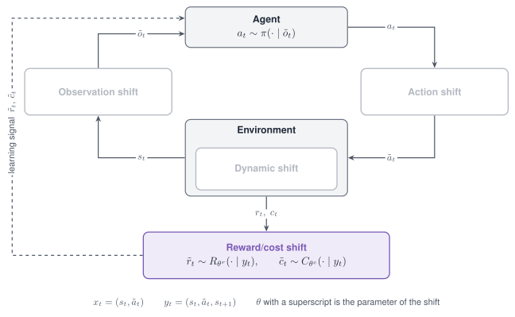

# Reward/cost shift

A Reward/cost shift changes the learning signal. It perturbs the scalar reward returned by
`step`, or a cost field of the `info` dictionary, and leaves the observation, the action and
the dynamics untouched.

{ width="760" }

*The Reward/cost shift acts on the learning signal: the reward and the cost that reach the learner are perturbed.*

<figure class="rl-shift-comparison">
  <div class="rl-shift-clips">
    <div><span>Nominal</span><video src="../../../../assets/shifts/reward-hopper_nominal_web.mp4" poster="../../../../assets/shifts/reward-hopper_nominal_web.jpg" autoplay muted loop playsinline controls preload="metadata" aria-label="Hopper policy trained with the reward on time"></video></div>
    <div><span>Shifted</span><video src="../../../../assets/shifts/reward-hopper_shift_web.mp4" poster="../../../../assets/shifts/reward-hopper_shift_web.jpg" autoplay muted loop playsinline controls preload="metadata" aria-label="Hopper policy trained with the reward released every 64 steps"></video></div>
  </div>
  <figcaption>Two SAC policies on the nominal Hopper task: one trained with the reward on time, one with the reward released every 64 steps. A frozen policy does not read the reward, so the shift acts during training.</figcaption>
</figure>

## Properties

| Aspect | Reward/cost shift |
|---|---|
| Perturbs | The reward, or a cost field in `info` |
| Targets in code | `reward` and `cost` |
| Modes | Stochastic, Parametric, Non-stationary, Composition |
| Applied | At every `step` |
| Acts on a frozen policy | No; it is applied during training |
| Simulators | Any; the shift needs nothing from the simulator |

## Supported modes

| Mode | Mode name in code | What it does |
|---|---|---|
| [Stochastic](../modes/stochastic.md) | `gauss` | Adds one Gaussian draw per step |
| [Stochastic](../modes/stochastic.md) | `uniform` | Adds one uniform draw per step |
| [Parametric](../modes/parametric.md) | `shift` | Adds a constant at every step |
| [Non-stationary](../modes/non-stationary.md) | `schedule` on any of the three mode names | Varies the noise level or the offset within the episode |
| [Composition](../modes/composition.md) | Several shifts in one list | Corrupts the reward and the cost, or stacks two corruptions |

The Adversarial mode is not defined for this shift. **`cost` has no delay**; the mode name
`delay` postpones the reward and belongs to the [Latency shift](latency.md).

## Parameters

| Mode name | Parameter | Type | Default | Meaning |
|---|---|---|---|---|
| `gauss` | `mu` | float | `0.0` | Mean of the noise |
| | `sigma` | float | `0.05` | Standard deviation of the noise |
| `uniform` | `low`, `high` | float | minus `range`, `range` | Bounds of the noise |
| | `range` | float | `0.1` | Shorthand for a symmetric interval |
| `shift` | `shift` | float | `value`, else `0.0` | The constant |
| all, on the target `cost` | `info_key` | str | `"cost"` | The field of `info` that is perturbed; a missing field counts as 0 |

## Declare the shift

```python
from robustrllib import make_robust, ShiftSpec

STOCHASTIC = {
    "gauss":   ShiftSpec("reward", "gauss", {"sigma": 0.5}),
    "uniform": ShiftSpec("reward", "uniform", {"low": -0.5, "high": 0.5}),
}
PARAMETRIC = ShiftSpec("reward", "shift", {"shift": -0.5})
COST = ShiftSpec("cost", "gauss", {"sigma": 0.1, "info_key": "cost"})
```

Non-stationary, with reward noise that grows within the episode:

```python
NON_STATIONARY = ShiftSpec(
    "reward", "gauss", {"sigma": 0.5},
    schedule={"type": "linear", "start": 0.0, "end": 1.0, "t0": 0, "t1": 500},
)
```

Composition of a reward corruption and a cost corruption:

```python
COMPOSITION = [
    ShiftSpec("reward", "gauss", {"sigma": 0.5}),
    ShiftSpec("cost", "shift", {"shift": 0.1}),
]
```

A shift on the target `reward` changes the reward; a shift on the target `cost` changes the
field in `info` and leaves the reward alone.

```python
import numpy as np


def first_step(shifts):
    env = make_robust("Hopper-v5", shifts=shifts, seed=0)
    env.reset(seed=0)
    _, reward, _, _, info = env.step(np.zeros(3))
    env.close()
    return round(float(reward), 3), info.get("cost")


print(first_step([]))
print(first_step([PARAMETRIC]))
print(first_step([ShiftSpec("cost", "shift", {"shift": 0.1})]))
```

```text
(0.999, None)
(0.499, None)
(0.999, 0.1)
```

The shift is carried into training by the launcher: `robustrllib/configs/train_shifts.yaml`
defines the arms the benchmark uses, and `baselines/train.py --train-shift reward_gauss` selects
one.

```yaml title="robustrllib/configs/train_shifts.yaml (excerpt)"
reward_gauss:
- target: reward
  mode: gauss
  params: {sigma: 0.5}
```

An online method receives the shift in the shift list of its training environment. An offline
method learns from a dataset, so the same corruption is applied to the rewards of the dataset,
seeded from the run's seed.

!!! note
    A frozen policy does not read the reward. Applied at evaluation time, a Reward/cost shift
    changes the measured return and leaves the trajectory as it was.

## Rules

- A Reward/cost shift is studied by training under it and evaluating on the nominal task.
- The target `reward` changes the reward; the target `cost` changes a field of `info`.
- `info_key` names the cost field when the task does not call it `cost`.
- The mode names are `gauss`, `uniform` and `shift`; every other mode name raises `ValueError`
  no later than the first `step`.
- A delayed reward is declared as a Latency shift with the mode name `delay`.
- The noise level is given in the units of the reward, not as a fraction of it.
