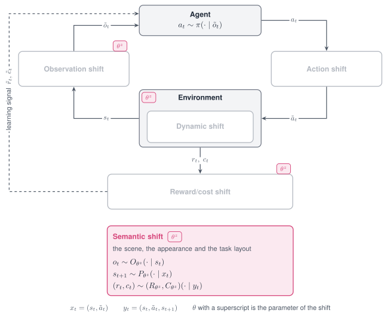

# Semantic shift

A Semantic shift changes what the scene looks like and where things are. It edits the colour of
objects, the lights and the cameras, and it displaces objects and cameras by a position offset.

{ width="760" }

*The Semantic shift acts on the scene, and through it on the observation, the transition and the reward.*

<figure class="rl-shift-comparison">
  <div class="rl-shift-clips">
    <div><span>Nominal</span><video src="../../../../assets/shifts/fetchreach_semantic_nominal.mp4" poster="../../../../assets/shifts/fetchreach_semantic_nominal.jpg" autoplay muted loop playsinline controls preload="metadata" aria-label="FetchReach with the nominal target"></video></div>
    <div><span>Shifted</span><video src="../../../../assets/shifts/fetchreach_semantic_shift.mp4" poster="../../../../assets/shifts/fetchreach_semantic_shift.jpg" autoplay muted loop playsinline controls preload="metadata" aria-label="FetchReach with a shifted target"></video></div>
  </div>
  <figcaption>FetchReach: the shift moves the reaching target in the scene, changing where the robot arm must move to complete the task.</figcaption>
</figure>

## Properties

| Aspect | Semantic shift |
|---|---|
| Perturbs | Geom colours, lights, cameras, and the position of objects and cameras |
| Targets in code | `appearance`; `dynamics` with the mode name `translate` for position offsets |
| Modes | Stochastic, Parametric, Non-stationary, Composition |
| Applied | At every `reset`; with a schedule before every step |
| Acts on a frozen policy | Yes, for policies that read rendered images or object positions |
| Backends | MuJoCo |

## Supported modes

| Mode | Mode name in code | What it does |
|---|---|---|
| [Parametric](../modes/parametric.md) | `hue` | Rotates the colour of a geom in hue and keeps saturation and brightness |
| [Parametric](../modes/parametric.md) | `tint` | Sets the colour of a geom to a saturated hue |
| [Parametric](../modes/parametric.md) | `swap` | Exchanges the colours of two geoms |
| [Parametric](../modes/parametric.md) | `scale`, `set` | Scales or sets a light or camera parameter |
| [Parametric](../modes/parametric.md) | `translate` | Adds an offset in metres to the position of an object, a camera or a light |
| [Stochastic](../modes/stochastic.md) | `gauss`, `uniform`, `loguniform` | Draws a factor on a light or camera parameter once per episode |
| [Non-stationary](../modes/non-stationary.md) | `schedule` on `hue`, `tint`, `swap`, `scale` and `translate` | Varies the rotation, the blend or the offset within the episode |
| [Composition](../modes/composition.md) | Several shifts in one list | Crosses an appearance change with a displacement |

The Adversarial mode is not defined for this shift.

## Parameters

Colour mode names on the target `appearance`:

| Mode name | Parameter | Type | Default | Meaning |
|---|---|---|---|---|
| `hue`, `tint` | `geom_prefix` | str or list | none | Every visible geom whose name starts with the prefix |
| | `geoms` | list | none | Geoms by name or position |
| | `geom` | str or int | none | One geom |
| `hue` | `degrees` | float | `0.0` | Rotation of the hue |
| `tint` | `degrees` | float | `0.0` | Hue of the colour that is set, as an angle |
| | `saturation` | float | `0.85` | Saturation of that colour |
| | `value` | float | `1.0` | Brightness of that colour |
| `swap` | `geom_a`, `geom_b` | str or int | required | The two geoms that exchange colours |

One of `geom_prefix`, `geoms` and `geom` is required; the first one present in this order is
used.

Lights, cameras and positions:

| Mode name | Target | Parameter | Meaning |
|---|---|---|---|
| `scale`, `set`, `gauss`, `uniform`, `loguniform` | `appearance` | `param`, `index` and the parameters of the mode name | As for the [Dynamic shift](dynamic.md), on the names below |
| `translate` | `appearance` | `param`, `index`, `offset` | Offset on `light_pos` or `cam_pos` |
| `translate` | `dynamics` | `param`, `index`, `offset` | Offset on `cam_pos`, `body_pos_xyz` or `freejoint_pos` |

| `param` | Edits |
|---|---|
| `geom_rgba`, `mat_rgba` | Colour of a geom or of a material |
| `light_diffuse`, `light_ambient`, `light_pos` | Colour and position of a light |
| `cam_pos`, `cam_quat`, `cam_fovy` | Position, orientation and field of view of a camera |
| `body_pos_xyz` | Position of a body that is fixed to its parent |
| `freejoint_pos` | Position of a free-floating object |

## Declare the shift

```python
from robustrllib import make_robust, ShiftSpec

BODY = ["torso_geom", "thigh_geom", "leg_geom", "foot_geom"]

PARAMETRIC = {
    "hue":   ShiftSpec("appearance", "hue", {"geoms": BODY, "degrees": 60}),
    "tint":  ShiftSpec("appearance", "tint", {"geom": "torso_geom", "degrees": 200, "saturation": 0.85}),
    "swap":  ShiftSpec("appearance", "swap", {"geom_a": "torso_geom", "geom_b": "floor"}),
    "scale": ShiftSpec("appearance", "scale", {"param": "light_diffuse", "index": "all", "factor": 0.5}),
    "set":   ShiftSpec("appearance", "set", {"param": "cam_fovy", "index": "track", "value": 60.0}),
}
STOCHASTIC = ShiftSpec("appearance", "uniform", {"param": "light_diffuse", "index": "all",
                                                 "low": 0.5, "high": 1.0})
```

Position offsets, as the semantic grids write them:

```python
DISPLACEMENT = {
    "camera": ShiftSpec("dynamics", "translate", {"param": "cam_pos", "index": "track",
                                                  "offset": [0.02, 0.0, 0.0]}),
    "body":   ShiftSpec("dynamics", "translate", {"param": "body_pos_xyz", "index": "foot",
                                                  "offset": [0.06, 0.0, 0.0]}),
}
```

Non-stationary, with a colour that changes gradually within the episode:

```python
NON_STATIONARY = ShiftSpec(
    "appearance", "hue", {"geoms": BODY, "degrees": 120},
    schedule={"type": "linear", "start": 0.0, "end": 1.0, "t0": 0, "t1": 500},
)
```

Composition of an appearance change and a displacement:

```python
COMPOSITION = [PARAMETRIC["hue"], DISPLACEMENT["body"]]
env = make_robust("Hopper-v5", shifts=COMPOSITION, seed=0)
env.reset(seed=0)
```

The colour of a geom is read from the model.

```python
import numpy as np

nominal = make_robust("Hopper-v5", seed=0)
nominal.reset(seed=0)
shifted = make_robust("Hopper-v5", shifts=[ShiftSpec(
    "appearance", "hue", {"geom": "torso_geom", "degrees": 180})], seed=0)
shifted.reset(seed=0)

torso = 1          # position of torso_geom in the model
print(np.round(nominal.unwrapped.model.geom_rgba[torso, :3], 2))
print(np.round(shifted.unwrapped.model.geom_rgba[torso, :3], 2))
```

```text
[0.8 0.6 0.4]
[0.4 0.6 0.8]
```

On a task whose object changes between resets, a prefix names the object instead of its geoms.
The grid entries below tint two objects of a manipulation scene.

```yaml
- {target: appearance, mode: tint, params: {geom_prefix: obj_0, degrees: 210}}
- {target: appearance, mode: tint, params: {geom_prefix: obj_1, degrees: 30}}
```

!!! note
    The observation of `Hopper-v5` is a state vector, so a colour change does not alter it. The
    shift matters for policies that read rendered images.

## Rules

- `hue` is written for geoms whose own colour is rendered; `tint` for geoms whose colour comes
  from a texture.
- **A colour shift that cannot change the rendered colour raises `ValueError`**: `hue` on a
  white, grey or black geom, and `swap` between two geoms of the same colour.
- `swap` is written when the instruction names a colour and two objects should exchange theirs.
- A displacement is an offset in metres, written with `translate`; a scale factor cannot express
  it.
- The offset is added to the position the task gave the entity in the current episode.
- `geom_prefix` is written for objects whose number of geoms changes between resets.
